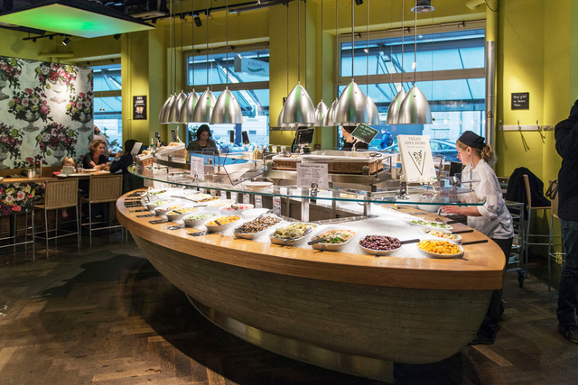
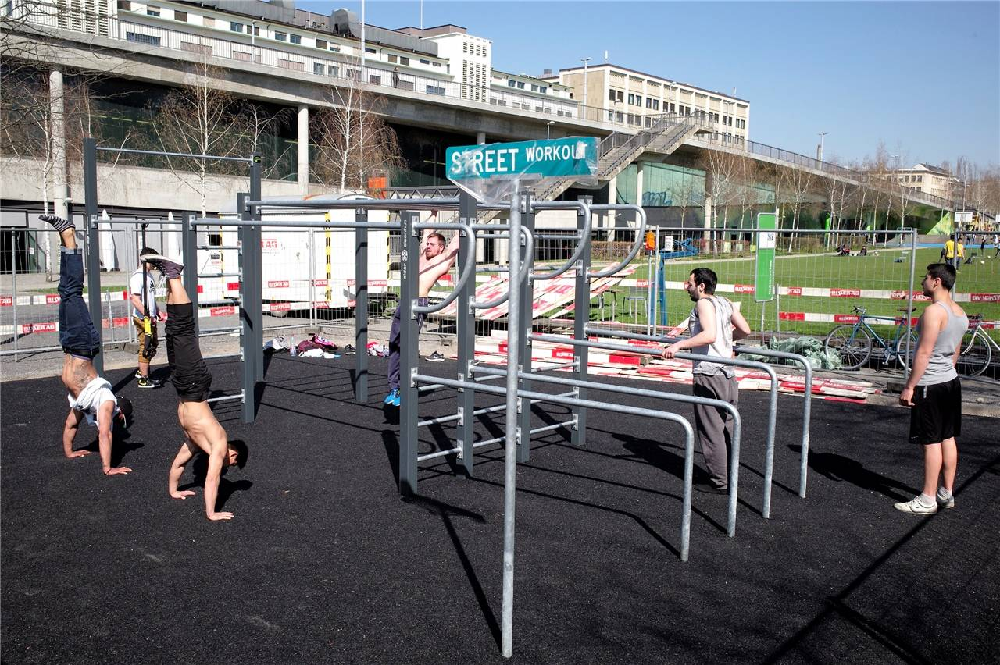
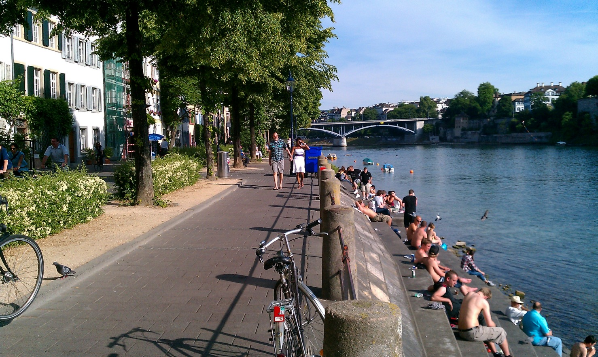

> The river Rhine on the Swiss side is wonderful to swim in. You may buy those plastic bags you see in the picture in a regular supermarket for about €15. Then just put your clothes in it and float down the river.

### 11 may - 7 june 2018
We stayed in an Airbnb apartment in Fischerstraße in Germany just a minute from the Swiss border. It's cheaper on the German side compared to the Swiss side, although not as nice. If you want to go jogging between the German, French and Swiss parts then you will rarely be stopped. We were only stopped one time by the German police asking us for our passports, and we crossed the French and Swiss border several times every day. It was a little uncomfortable getting stopped. They were armed and weren't very nice.

<iframe src="https://www.google.com/maps/embed?pb=!1m18!1m12!1m3!1d6931.433713426529!2d7.591145767722511!3d47.58682655488994!2m3!1f0!2f0!3f0!3m2!1i1024!2i768!4f13.1!3m3!1m2!1s0x4791b987cbe28811%3A0xbc4cb268ab1bd617!2sFischerstra%C3%9Fe%2C+79576+Weil+am+Rhein%2C+Germany!5e0!3m2!1sen!2sit!4v1529923851862" width="600" height="450" frameborder="0" style="border:0" allowfullscreen></iframe>

### Food
If you are on the German side close to Weil am Rhein then [Alnatura](https://www.alnatura.de/de-de/m%C3%A4rkte/alnatura-filialen-detailseiten/w/weil-am-rhein-alnatura-super-natur-markt-l%C3%B6025) is what I recommend. Good products and cheaper than in Switzerland.
In the Swiss part you have [MÜLLER Reformhaus](www.reformhaus.ch/) and [Tibits](https://www.tibits.ch/de/). We only went out to eat on rare occasions. It's easy to find good food to make a meal at home. 

### Activity
If you are looking to workout outside then checkout [Basel Street Workout Park](https://calisthenics-parks.com/spots/529-en-street-workout-park-in-basel-switzerland). It's free of course. It's also nice to go jogging next to the river, preferably on the French and Swiss side.

