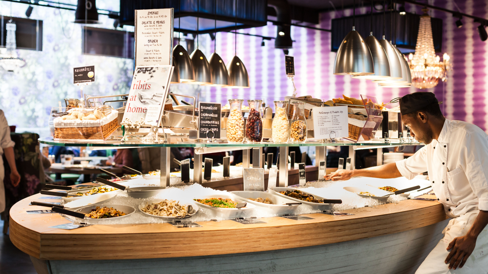
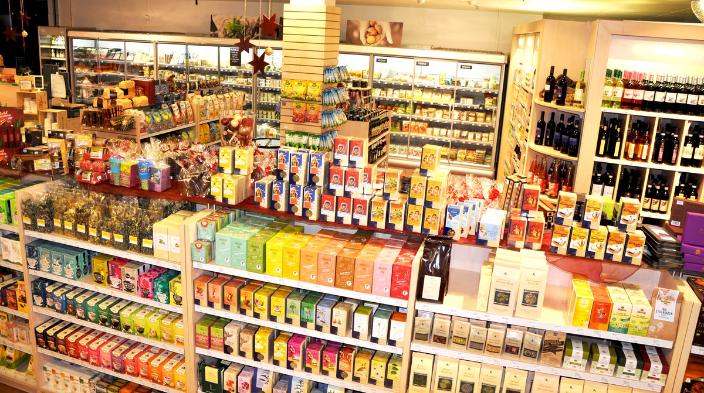

> Bern is nice I guess. Amazing mountain view. You can easily travel to other cities in the country from Bern without spending a lot of time.

### 3 - 9 may 2018
We stayed at Hine Adon Hotel near the Bern airport from 3 - 5 may. It's reasonable priced, quiet, has nice rooms with a kitchenette and it has a self service check-in at night. I do recommend this place if you are ok with staying outside the city. It's just next to a train station so traveling to the city center is easy. We also stayed at Hotel National from 5 - 7 may. This has become our goto hotel every time we are in Bern since it very close to the central station and it's usually the cheapest hotel available on the booking web sites. We wanted to schedule a few apartment viewings for long term rental in Bern so it was convenient for us to stay there. We ended up seeing four apartments (Europaplatz, Riedbachstrasse on the Westside, Tertianum Résidence, Brunngasse in the center), but decided they weren't right. It's actually completely possible to find a 30 - 40m² apartment for under €1.000 a month i Bern. The last place we stayed at was in a private room rented on Airbnb in an area called Murzelen. Here we stayed from 7 - 9 may. This was by far the cheapest place to stay. 

<iframe src="https://www.google.com/maps/embed?pb=!1m18!1m12!1m3!1d87147.46776127761!2d7.324658402757539!3d46.95464849027674!2m3!1f0!2f0!3f0!3m2!1i1024!2i768!4f13.1!3m3!1m2!1s0x478e39c0d43a1b77%3A0xcb555ffe0457659a!2sBern%2C+Switzerland!5e0!3m2!1sen!2sit!4v1529867131370" width="600" height="450" frameborder="0" style="border:0" allowfullscreen></iframe>

### Food
You have the safe and reliable [Tibits](https://www.tibits.ch/de/) at Bern Bahnhof and at Gurtengasse 3, also in the center. At Bern Bahnhof you also have [Egli bio reform AG](http://www.eglibio.ch/content/home/index_ger.html) 

 
 
