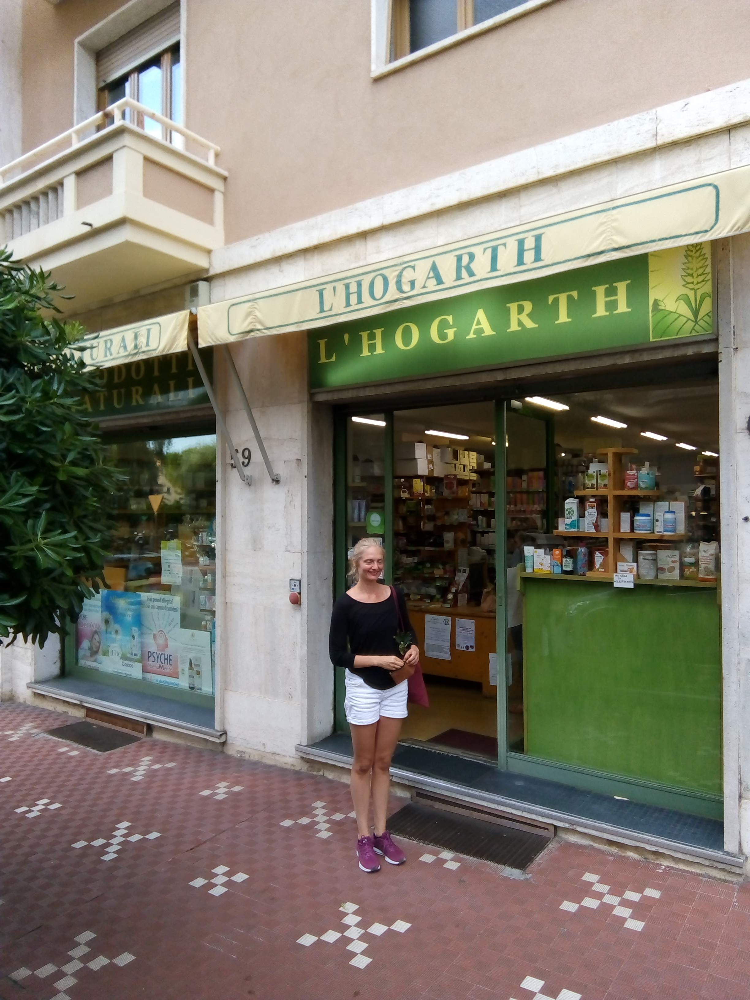
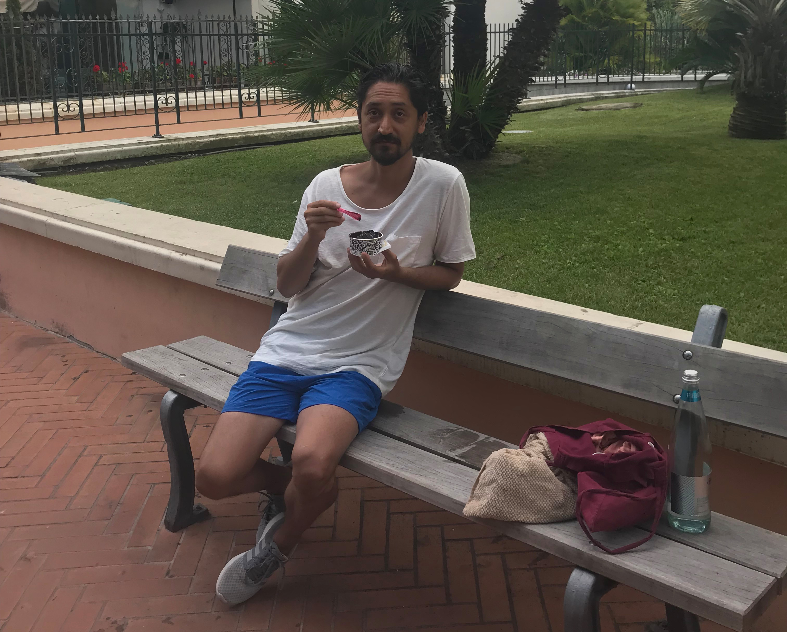
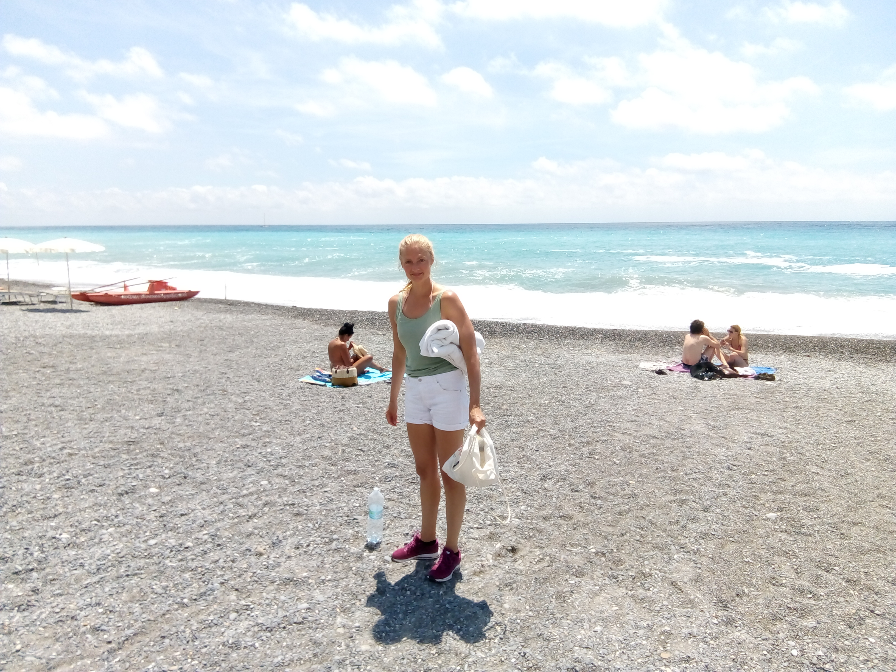
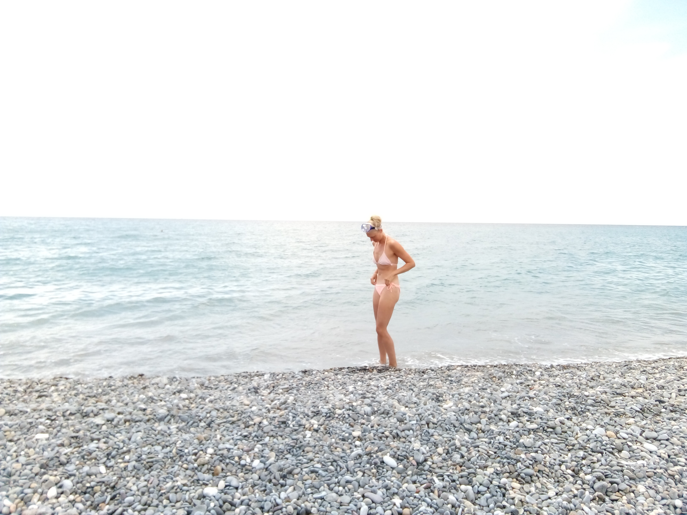
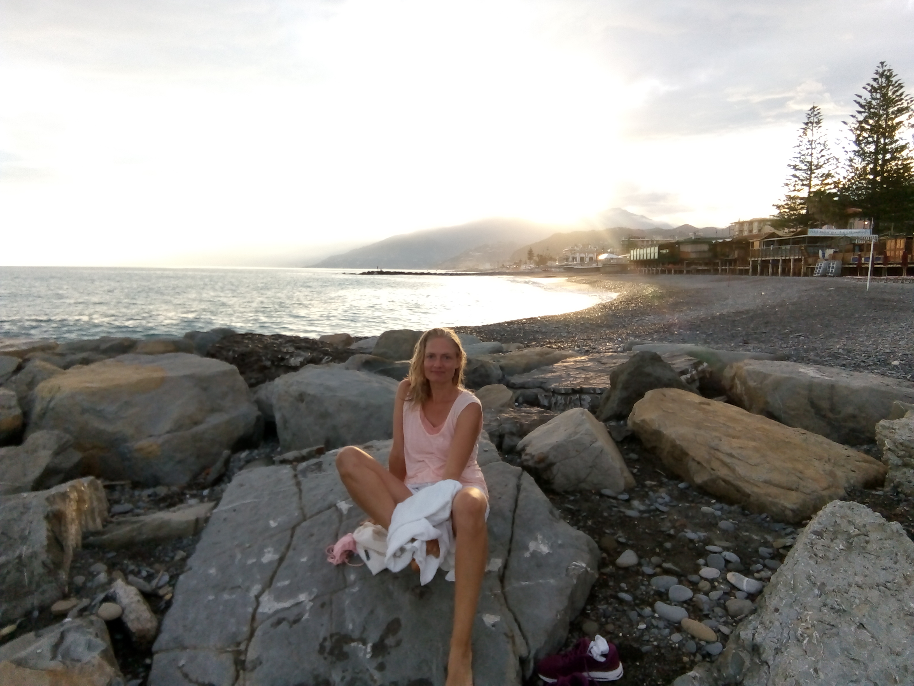
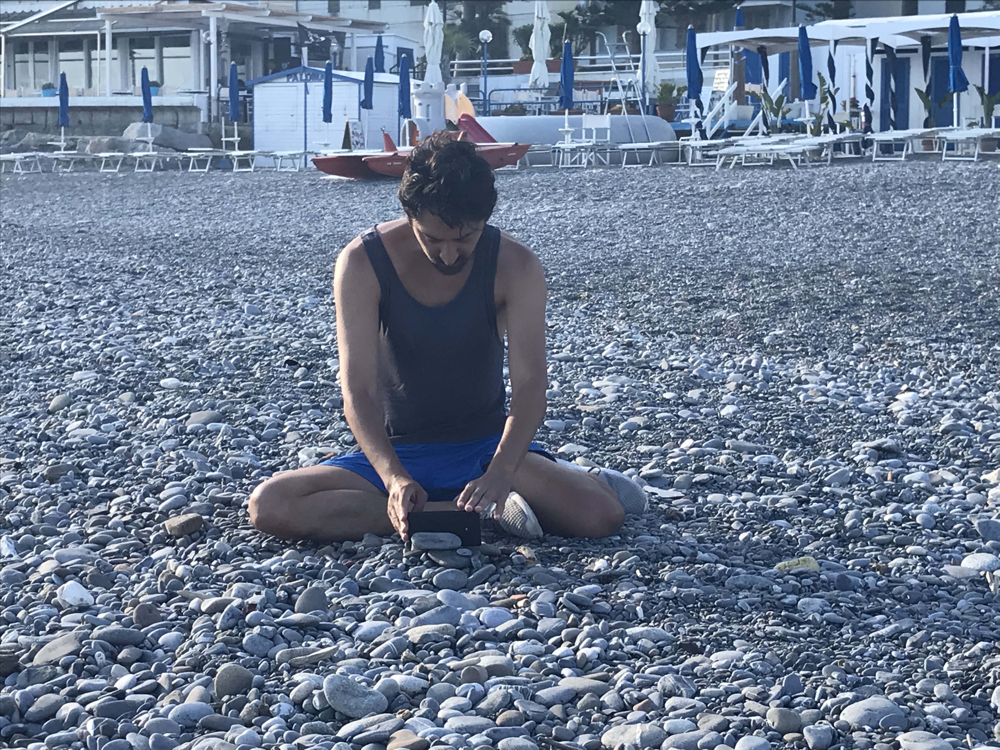

> Fantastic beach, friendly people, sunny weather, quiet area, lots of good food, not too expensive and the ice cream is just the best. Just wow!

### 7 - 29 june 2018
We booked an apartment through Airbnb for one week. It was such a wonderful place so we extended our stay with another week. After two weeks of heaven we had to leave, so we checked-out and took the train to Nice, France. We tried to look for a place in Nice, but to make a long story short we couldn't find anything and had to ask Anna, the woman who owns the apartment we rented in Bordighera, if we could come back and stay another 8 days. It was difficult to leave such a nice place. So to wrap it up: this place is highly recommended. There aren't many tourists here in the beginning of june. 

<iframe src="https://www.google.com/maps/embed?pb=!1m18!1m12!1m3!1d23041.421455722793!2d7.649682565387162!3d43.789925963461336!2m3!1f0!2f0!3f0!3m2!1i1024!2i768!4f13.1!3m3!1m2!1s0x12cdf3b7493a1e09%3A0x4e876555b0b2bb3!2s18012+Bordighera%2C+Province+of+Imperia!5e0!3m2!1sen!2sit!4v1529943551869" width="600" height="450" frameborder="0" style="border:0" allowfullscreen></iframe>

### Food
This is real simple. You buy your groceries at [L'Hogarth Srl](https://goo.gl/maps/Lc1e8hvtZG12) or [Calicantus Di Belfi Manuela Cristina](https://goo.gl/maps/ukJ3MSHjHrP2) and your ice cream at [L'officina Del Gusto](https://goo.gl/maps/ZbmX2qkYyaK2). My favorite ice cream flavor is the chocolate fondant, 1 scoop is €1. There is also a 24 hour/7 days a week open [Carrefour Market - Supermarket](https://goo.gl/maps/EKAiuDbcMrQ2) and it's quite big. A cappuccino with soy milk is €1.5. It's really good, and I'm not even a coffee drinker.

 

 

### Activity
There are several things you can do here, like play tennis, wind surfing, workout at the gym or watch a movie at the movie theatre, but we did none of those things. We basically just spent a lot of time on the beach and did some jogging in the morning. There is a playground for kids where there are some bars you can do pull-ups and other exercises on. Who needs a gym when you can workout at the beach :). There is not a lot of people outside in the morning so it's really nice to stroll along the beach and listen to the waves. By the way, a haircut is €10. Too much hair for a hot summer.

### The Beach
There are a lot of public beaches here so not worry if you don't want to pay to lay on the beach. I believe the private beaches are about €15 for a day. The Beach is made of mainly small pebbles with patches of sand. The water is warm and the waves not too high. There is usually not that many people on the beach. Of course this may not be the case in July or August.

 

 

 

 

<iframe width="560" height="315" src="https://www.youtube.com/embed/IKyQkx0HqTM?ecver=1" frameborder="0" allow="autoplay; encrypted-media" allowfullscreen></iframe>