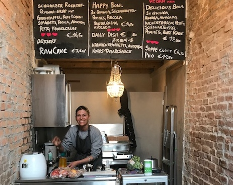
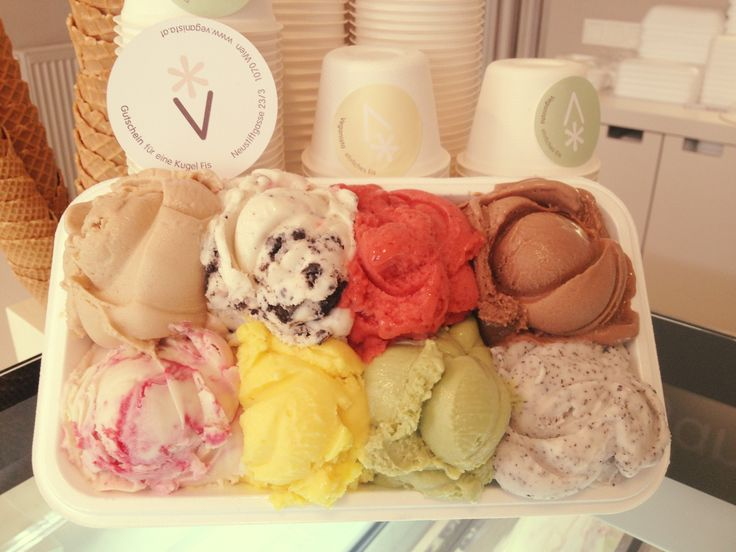
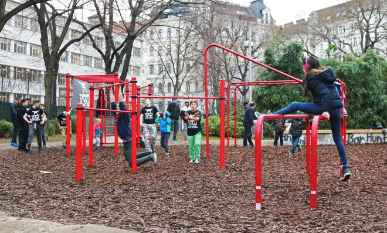

> A sad unhealthy place with pollution and cigarette filling your lungs. Isn't it funny when you've seen fantastic pictures of a place and when you get there it's totally not like the pictures. Well, we tried to make the best of it and we did find a few good places :).

### 30 mars - 27 april 2018
We stayed at an Airbnb appartment in Goldschlagstraße, about 5 minutes walking distance from Westbahnhof. Let me just say, this is **not** the area you want to stay in. It's a poor neighourhood with people who look like they wish they could be somewhere else. I frankly did not feel safe walking outside after 8 pm. Smoking seems extremly popular here for some reason. So does not giving a shit :/. When we got there we immediately thought it was a mistake to book the place for a month. 

<iframe src="https://www.google.com/maps/embed?pb=!1m18!1m12!1m3!1d2659.5096215736576!2d16.33551321565111!3d48.196799079228185!2m3!1f0!2f0!3f0!3m2!1i1024!2i768!4f13.1!3m3!1m2!1s0x476d07f5b7c27433%3A0x6be46148d7640a51!2sWien+Westbahnhof!5e0!3m2!1sen!2sit!4v1529744336903" width="600" height="450" frameborder="0" style="border:0" allowfullscreen></iframe>

### Food
So here's the good news! For icecream you will want to go [Veganista](https://www.veganista.at). Their icecream is probably the best I have ever tasted. For groceries, goto [MaranVegan](http://www.maranvegan.at) or [Denns Biomarkt](http://denns-biomarkt.at). For restaurants you have [Lovinghut](http://lovinghut.at/neubau/). They actually have really tasty food and not that expensive. They are quick to prepare the food and very friendly. Then you have the [Delicious Vegan Bistro](http://delicious.or.at/). Martina, running the place, is very friendly and cooks everything her self with only the best of ingredients. We also eat several times at [Reformhaus Buchmüller](http://www.reformhaus-buchmueller.at/newweb/index.htm) at Neubaugasse 17. It's both a healthfood store and a cafe. Thumbs up here as well. I would also like to recommend [JuiceDeli](https://www.juicedeli.at/) if you want an Acai bowl, a fresh juice or something similar. 

### Clothes
Just two words! [Muso Koroni](https://www.muso-koroni.com/). You'll find it at Josefstädter Str. 33. Checkout it. I couldn't leave the store without a t-shirt, although i couldn't really afford it.

### Activity
We went to [GETFIT Fitness Club](http://getfitclub.at/) for a free workout if it's your first time there. No registration required, so easy and friendly. And when we were finished they just said "bye, have a nice day". That is how it should be in my opinion. The gym is well equipped, modern and clean. [Yogacollege](http://yogacollege.at/) is also a place I would like to recommend. They have  good offers: €10 for 10 days and €30 for 30 days. Also, the language does not seem to be an issue. I don't understand german at all and everything worked out fine for me. In the [Esterházypark](https://www.google.com/maps/place/Esterh%C3%A1zypark/@48.1972363,16.3513272,18.01z/data=!4m8!1m2!2m1!1srock+climbing!3m4!1s0x476d0789343ba7c3:0x162576c5cf15df66!8m2!3d48.1974998!4d16.3525003) you have [street workout where you can do your calisthenics](https://hardbodyhang.com/project/wien-au-esterhazy-park)

